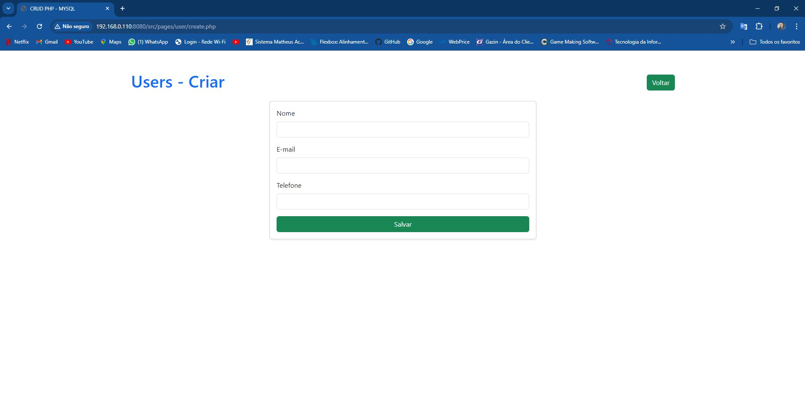
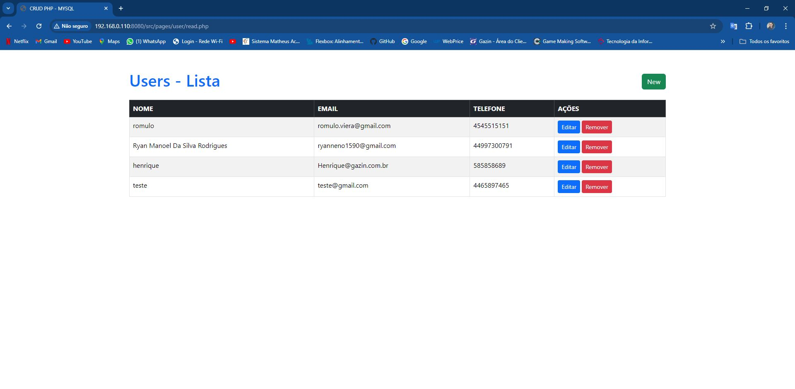
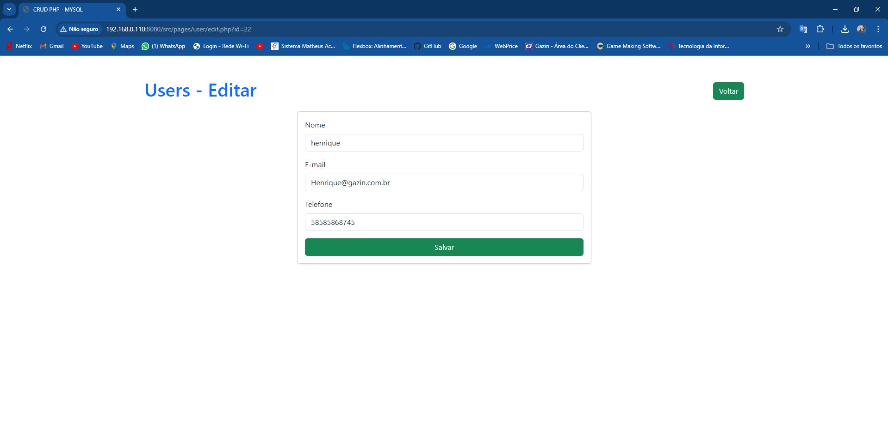
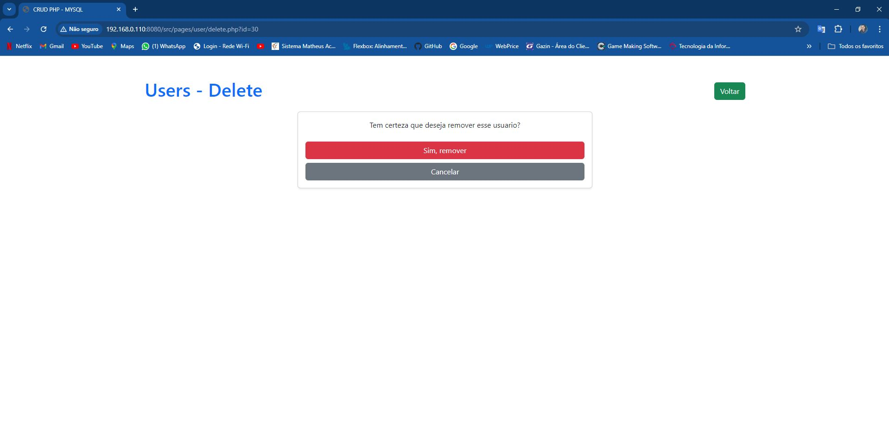
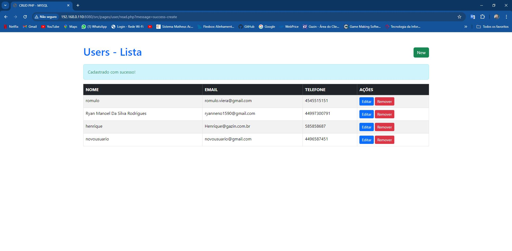
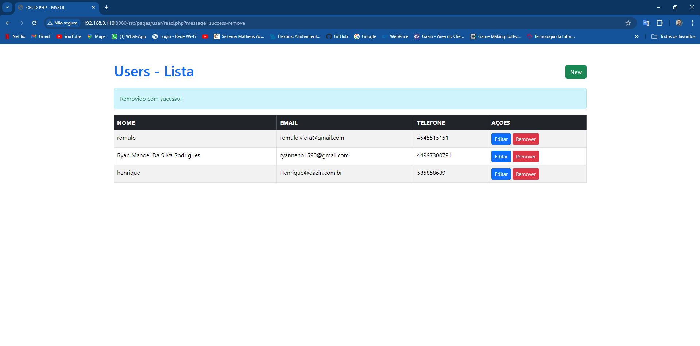

# Crud com PHP e MySQL

### ⚙️ O que é

Crud php configurado docker

### 📌 A quem se destina

Desenvolvedores iniciantes com conhecimento básico em php e banco de dados e docker 

### Como rodar

- Clone o repositório 'git clone https://github.com/Ryan1590/ProjetoDocker.git';
- Em seu banco de dados, importe o sql presente na raiz do projeto; 
- Ou usar o docker
- Inicie seus servidores de aplicação e banco de dados e abra o projeto no seu navegador.

# Telas do crud
## Create

## Read

## Edit

## Delete

# Mensagens da operação
## Mensagem Create

## Mensagem Edit

## Mensagem Delete
